#  Лабораторна робота 4:


# [1](lb4.1.c)

Теоретично, на 32-х біт можна виділити 1ТБ, а на 64-х біт це значення має сягати 16 ексабайтів. Насправді ж практично це неможливо, адже процесор не використовує всі 64 біти адресації. Також, іноді верхні біти в 64-бітній адресі не використовуються або зарезервовані. У x86_64 верхні 16 бітів можуть бути знаковим розширенням (canonical addressing), тож фактично залишається тільки 48 бітів реального адресного простору.

Виставимо значення для size_t в 16 ексабайтів і запустимо програму:
```python
size_t big = (size_t)1 << 63;
```

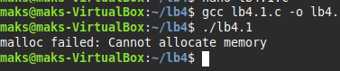

Як бачимо, наша операційна система не дозволяє такий обсяг. Тепер спробуємо запустити на 32-х біт та на 64 з вказаним аргументом size_t на 1 тб:
```python
size_t big = (size_t)1 * 1024 * 1024 * 1024 * 1024;
``` 
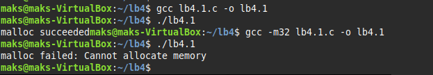

Скомпілював спочатку для x86_64 а потім для x86 системи через ```-m32``` та отримав різний результат.

Можна дійти висновку, що реальна межа меньша як і в 64-х так і в 32-х бітних системах. Якщо продивитися вікіпедію, то можна дізнатися, що в більшості сучасних процесорів використовують 48 бітів, а це 256 террабайт, що й дорівнює фактичному максимуму.

---
# [2](lb4.2.c)

Якщо передати від’ємне значення через int до malloc, то воно буде перетворено на дуже велике значення типу size_t:
```c
int size = -1;
void* ptr = malloc(size); //size_t(-1) = 2^64 -1
```

Можна зробити код і передати в аргументи ```xa = 1 << 30; xb = -1```.

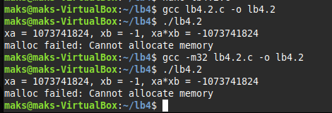

Що на 64-х, що на 32-х бітах буде переповнення при будь-якому негативному аргументі.

---
# [3](lb4.3.c)

Зробимо програму яка буде перевіряти або NULL вивід, або якийсь поінтер.

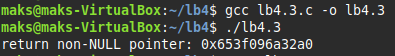

Програма вивела не нульовий поінтер.

Запуск через ```ltrace```:

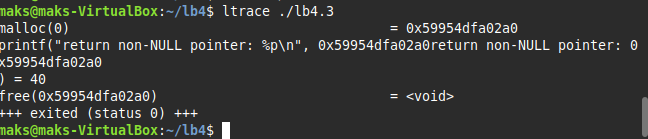

Вивід NULL або non-NULL pointer-а залежить від реалізації бібліотеки C в системі. Вказівник утворюється з розміром=0, тому можна викликати для нього ```free()```.

---
# [4](lb4.4.c)

У заданому коді:
```c
void *ptr = NULL;
while (<some-condition-is-true>) {
    if (!ptr)
        ptr = malloc(n);
    [... <використання 'ptr'> ...]
    free(ptr);
}
```
Є помилока. Ми викликаємо ```malloc(n)``` лише один раз, в той час як ```free(ptr)``` використовується кожну ітерацію. Це призводить до того, що на другій і наступних ітераціях ```ptr``` вже недійсний, бо був звільнений. Тому я переробив код так, щоб пам'ять виділялася в кожній ітерації.

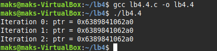

---
# [5](lb4.5.c)

Зробимо приклад, де виділимо пам'ять для 64-х та 32-х бітної системи 3gb:

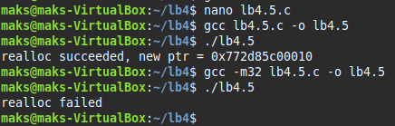

Як бачимо, для 32-х бітної системи це занадто велике значення і він не виділив для нього пам'яті. Якби ми зробили так:
```c
ptr = realloc(ptr, new_size);
```
І ```realloc``` не зміг би виділити новий блок пам'яті, він би повернув NULL і старий блок би не звільнявся, що б презвело до витіку пам'яті.

---
# [6](lb4.6.c)

Перевіримо усі сценарії, де ptr = ```realloc(NULL,100)``` , ```realloc(ptr,0)``` та ```realloc(NULL,0)```:

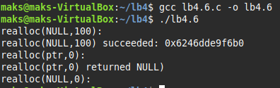

```realloc(NULL,SIZE)``` працює як ```malloc(size)```, 

```realloc(ptr,0)``` як ```free(ptr) + NULL```,

```realloc(NULL,0)``` як просто NULL

---
# [7](lb4.7.c)

Переписав код, який включає в себе reallocarray. Запускаю через ```ltrace``` та звичайно:

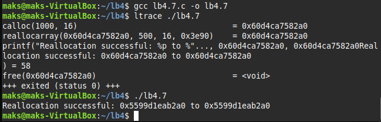

---
# [10](lb4.10.c)

В моєму завданні по варіантам потрібно дослідити розподіл пам’яті в структурі heap Linux. Як ми вже дізналися, heap виділяється за допомогою ```malloc()``` , ```calloc()``` та ```realloc()```. Керується heap за допомогою ```brk()``` або ```mmap()``` які залежать від виділених об'ємів. Тобто, малі об’єми (<128KB) використовують ```brk()``` , тобто розширюють heap. Великі об’єми (>=128KB) використовують ```mmap()```, створюють окремий сегмент

Зробив невеличкий код, який щось виділяє та входить в сон, аби я зміг розглянути мапу в пам'яті за допомогою ```cat /proc/<pid>/maps | grep heap``` та ```brk()``` за допомогою ```-A10```:

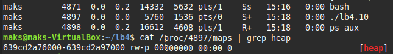

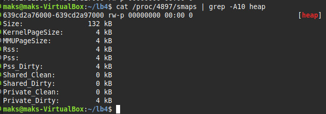

Перевіримо системні виклики через ```strace ./lb4.10 2>&1 | grep brk```:

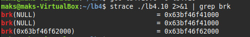
